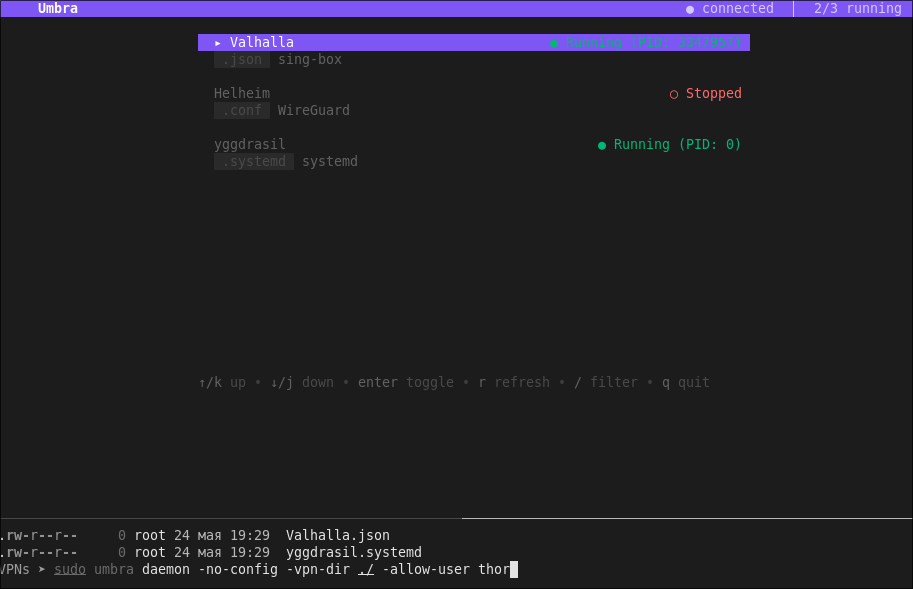

# Umbra — VPN controller daemon + TUI + tray

Daemon + TUI + tray. Monitors a folder for different VPN configs. One daemon to rule all VPN services



## Quick start

```bash
# go install .
go install github.com/AbandonwareDev/umbra@main
sudo umbra daemon -no-config -vpn-dir /yourVPNsFolder -allow-user $USER
umbra tui
umbra tray          # standalone tray, separate terminal
```

## NixOS / Flake

This repo includes a `flake.nix` with a package derivation and NixOS service module.

```bash
# Try it without installing (tray variant):
nix run github:AbandonwareDev/umbra -- help
nix run github:AbandonwareDev/umbra -- daemon -no-config -vpn-dir /yourVPNsFolder

# Headless variant (no tray dependency):
nix run github:AbandonwareDev/umbra#umbra-headless -- help
```

### NixOS module

Add to your flake inputs:

```nix
inputs = {
  nixpkgs.url = "github:NixOS/nixpkgs/nixos-unstable";
  umbra.url = "github:AbandonwareDev/umbra";
};
```

Import the module and enable the service:

```nix
{
  imports = [ umbra.nixosModules.umbra ];

  services.umbra.enable = true;
  services.umbra.vpnDir = "/etc/umbra/configs";
  services.umbra.allowUser = "alice";
}
```

Available options:

| Option | Type | Default | Description |
|--------|------|---------|-------------|
| `enable` | bool | `false` | Enable the Umbra VPN daemon |
| `package` | package | `pkgs.umbra-headless` | Umbra package (defaults to headless for server mode) |
| `vpnDir` | path | `/etc/umbra/configs` | Directory with VPN config files |
| `configFile` | nullOr path | `null` | Extension-mapping config (null = built-in defaults) |
| `noConfig` | bool | `true` | Skip config.yaml — built-in defaults only (more secure). Ignored when configFile is set |
| `logFile` | nullOr path | `null` | Log file path (null = journald) |
| `allowUser` | nullOr str | `null` | Username allowed to control daemon via IPC |
| `trustedPrefixes` | listOf str | `[ "/nix/store/" ... ]` | Allowed command path prefixes |
| `extraArgs` | listOf str | `[]` | Extra CLI arguments |

The service runs as root with systemd hardening (`NoNewPrivileges`, `ProtectHome`,
`ProtectSystem`, `PrivateTmp`). Trusted-command validation is enforced at the
code level via the `-trusted-prefixes` flag — only binaries under the listed
prefixes (e.g., `/nix/store/`, `/run/wrappers/bin/`, `/usr/bin/`) may be executed
as VPN start/stop commands.

### Local development

```bash
git clone https://github.com/AbandonwareDev/umbra
cd umbra
nix flake check --impure
nix build .#umbra-headless
./result/bin/umbra daemon --help
```

## Modes

**User mode** (`umbra daemon`): socket at `/tmp/umbra-$UID/daemon.sock`, tray enabled.  
VPNs that exit within 10s (likely need root) are re-launched via `pkexec` (max 2 retries, 1s delay).

**Root mode** (`sudo umbra daemon -allow-user <user>`): socket at `/tmp/umbra/daemon.sock`, tray disabled.  
Access control via `SO_PEERCRED` — only the allowed user and `networkmanager` group members can connect.  
Config folder chowned to root (`0755` dir, `0644` files) — user can read but not write or create files.

> **Security**: In root mode the config folder defaults to `/etc/umbra/configs/` (not `~/.umbra/`)
> so non-root users cannot bypass security through their home directory.

## VPN configs

Place `.ovpn`, `.conf`, `.torrc`, `.sgb`, or `.json` files in the VPN folder.  
Unrecognized extensions are ignored. Configs are sorted by type (OpenVPN → WireGuard → NetworkManager → sing-box → other → Tor), then alphabetically.

Custom commands via `~/.umbra/config.yaml`:

```yaml
extensions:
  .ext: "command --flag {{path}}"
```

`{{path}}` = full config path, `{{name}}` = filename without extension.  
Use `-no-config` to skip the config file (only built-in defaults).

## Working directory

VPN apps may create temp files in the current directory, so the daemon sets its working directory to `/tmp` before launching any VPN process.

